# Travel Assistant - Mastra AI Chat

> **Example Project**: This is a demo application showcasing how to integrate **Mastra** with **TanStack Start**. It demonstrates best practices for building AI-powered applications with agent networks, real-time streaming, and dynamic UI components.

A real-time AI travel assistant built with **Mastra**, **TanStack Start**, and **AI SDK**. Features agent networks, streaming responses, and dynamic UI rendering for tool calls, reasoning, and network execution.

## About This Example

This project serves as a **reference implementation** for:

* **Integrating Mastra with TanStack Start** - Full-stack TypeScript setup
* **Agent Networks** - How to implement routing agents that delegate to specialized sub-agents
* **Real-time Streaming UI** - Rendering different stream event types (text, tools, reasoning, network execution)
* **Thread Persistence** - Managing conversation history with Mastra's memory system
* **AI SDK Integration** - Using `@ai-sdk/react` with Mastra's backend

Use this as a starting point for building your own AI-powered applications with Mastra and TanStack Start.

## Features

* 🤖 **AI Agent Network** - Routing agent delegates to specialized agents (weather, destinations)
* 🔄 **Real-time Streaming** - See AI responses, tool calls, and reasoning as they happen
* 💬 **Thread Persistence** - Chat history saved to SQLite via Mastra
* 🎨 **Dynamic UI** - Renders different types of stream events:
  * Text responses
  * Tool invocations (parameters & results)
  * Network execution (agent routing decisions)
  * Model reasoning (chain of thought)

## Prerequisites

* [Bun](https://bun.sh/) installed
* Google Gemini API key ([Get one here](https://aistudio.google.com/app/apikey))

## Getting Started

### 1. Install Dependencies

```bash
bun install
```

### 2. Configure Environment Variables

Create a `.env` file in the root directory:

```bash
GOOGLE_GENERATIVE_AI_API_KEY=your_gemini_api_key_here
```

> **Important:** You must have a valid Gemini API key for the AI agents to work.

### 3. Run Development Server

```bash
bun run dev
```

This will start:

* **Mastra Backend** on `http://localhost:4111`
* **Frontend** on `http://localhost:3000`

### 4. Open the App

Navigate to `http://localhost:3000` and start chatting!

## Architecture: Stream System Flow

```mermaid
flowchart TD
    subgraph Frontend["Frontend (TanStack Start + React)"]
        User[👤 User types message]
        
        subgraph ReactHooks["React Hooks Layer"]
            UseChat["useChat() hook
            📦 @ai-sdk/react"]
            UseMastraClient["useMastraClient()
            📦 @mastra/react"]
            UseQuery["useQuery()
            📦 @tanstack/react-query"]
        end
        
        subgraph Transport["Transport Layer"]
            DefaultTransport["DefaultChatTransport
            📦 ai
            POST → http://localhost:4111/chat
            body: {threadId, resourceId}"]
        end
        
        subgraph State["State Management"]
            Messages["messages[] state
            Updated real-time"]
            Status["status: streaming/ready"]
        end
    end
    
    subgraph Backend["Mastra Backend (localhost:4111)"]
        subgraph Server["Mastra Server"]
            NetworkRoute["networkRoute()
            📦 @mastra/ai-sdk
            path: '/chat'
            agent: 'routingAgent'"]
        end
        
        subgraph AgentNetwork["Agent Network"]
            RoutingAgent["Routing Agent
            Analyzes request"]
            WeatherAgent["Weather Agent
            Gets weather data"]
            DestAgent["Destinations Agent
            Gets travel info"]
        end
        
        subgraph Storage["Persistence"]
            LibSQL["LibSQLStore
            📦 @mastra/libsql
            file: ./mastra.db"]
        end
    end
    
    subgraph StreamEvents["Stream Events (SSE/Streaming)"]
        TextChunk["text chunks
            type: 'text'"]
        ToolCall["tool calls
            type: 'tool-{toolName}'
            states: input-available,
                    output-available"]
        NetworkData["network execution
            type: 'data-network'
            steps[], status, task"]
        ReasoningData["reasoning
            type: 'reasoning'
            AI thinking process"]
    end
    
    subgraph Processing["Frontend Processing"]
        ToAISdk["toAISdkV5Messages()
        📦 @mastra/ai-sdk/ui
        Converts Mastra → AI SDK format"]
        
        ResolveMsg["resolveInitialMessages()
        Resolves network messages
        from memory storage"]
        
        FilterMsg["filterDisplayableMessages()
        Custom filter function
        Removes: completion checks,
                 network JSON,
                 empty messages,
                 reasoning (history only)"]
        
        RenderPart["MessagePartRenderer
        Switch by part.type:
        - text → MessageResponse
        - reasoning → Reasoning
        - data-network → NetworkExecution
        - tool-* → Tool"]
    end
    
    subgraph UIComponents["UI Components (ai-elements)"]
        MessageComp["Message
        MessageContent
        MessageResponse"]
        NetworkExec["NetworkExecution
        Shows agent routing,
        steps, decisions"]
        ToolComp["Tool
        ToolHeader, ToolInput,
        ToolOutput"]
        ReasoningComp["Reasoning
        ReasoningTrigger,
        ReasoningContent"]
    end
    
    User -->|types message| UseChat
    UseChat -->|sends via| DefaultTransport
    DefaultTransport -->|HTTP POST| NetworkRoute
    
    NetworkRoute -->|executes| RoutingAgent
    RoutingAgent -->|delegates to| WeatherAgent
    RoutingAgent -->|or delegates to| DestAgent
    
    WeatherAgent -->|streams back| TextChunk
    WeatherAgent -->|streams back| ToolCall
    RoutingAgent -->|streams back| NetworkData
    RoutingAgent -->|streams back| ReasoningData
    
    TextChunk -->|received by| UseChat
    ToolCall -->|received by| UseChat
    NetworkData -->|received by| UseChat
    ReasoningData -->|received by| UseChat
    
    UseChat -->|updates| Messages
    UseChat -->|updates| Status
    
    Messages -->|each part| RenderPart
    
    RenderPart -->|text| MessageComp
    RenderPart -->|data-network| NetworkExec
    RenderPart -->|tool-*| ToolComp
    RenderPart -->|reasoning| ReasoningComp
    
    NetworkRoute -.->|persists to| LibSQL
    
    subgraph HistoryLoad["Load History (Initial Load)"]
        UseQuery -->|calls| UseMastraClient
        UseMastraClient -->|listThreadMessages| LibSQL
        LibSQL -->|returns| ToAISdk
        ToAISdk -->|converts| ResolveMsg
        ResolveMsg -->|resolves| FilterMsg
        FilterMsg -->|setMessages| Messages
    end
    
    style Frontend fill:#e1f5ff
    style Backend fill:#fff4e1
    style StreamEvents fill:#f0e1ff
    style Processing fill:#e1ffe1
    style UIComponents fill:#ffe1e1
    style HistoryLoad fill:#f5f5f5
```



## How It Works

### 📤 Sending Messages (Streaming)

1. User types message → `useChat()` hook (@ai-sdk/react)
2. `DefaultChatTransport` → POST to `http://localhost:4111/chat`
3. Mastra backend receives via `networkRoute()` (@mastra/ai-sdk)
4. `routingAgent` analyzes and delegates to sub-agents
5. Real-time stream events:
   * `text` chunks
   * `tool-*` invocations
   * `data-network` agent execution
   * `reasoning` model thoughts
6. Frontend dynamically renders each part

### 📥 Loading History (Initial Load)

1. `useQuery()` + `useMastraClient()` → `listThreadMessages()`
2. `toAISdkV5Messages()` converts Mastra format → AI SDK format
3. `resolveInitialMessages()` resolves network execution data from memory
4. `filterDisplayableMessages()` removes internal system messages and reasoning from history
5. `setMessages()` sets chat history

### 🎨 Rendering

`MessagePartRenderer` component switches on `part.type`:

* **text** → `<MessageResponse>`
* **data-network** → `<NetworkExecution>` (shows routing decisions)
* **tool-**\* → `<Tool>` (parameters and results)
* **reasoning** → `<Reasoning>` (model thoughts, only during streaming)

## Project Structure

```
src/
├── components/
│   ├── ai-elements/        # Reusable AI UI components
│   │   ├── network-execution.tsx  # Agent network visualization
│   │   ├── tool.tsx              # Tool call display
│   │   ├── reasoning.tsx         # Model reasoning display
│   │   └── ...
│   ├── chat/               # Chat-specific components
│   │   ├── chat-empty-state.tsx  # Empty state UI
│   │   ├── chat-input.tsx        # Message input with actions
│   │   ├── chat-layout.tsx       # Chat page layout wrapper
│   │   ├── message-part-renderer.tsx  # Renders message parts by type
│   │   └── index.ts              # Barrel exports
│   └── ui/                 # shadcn/ui components
├── hooks/
│   ├── use-chat-navigation.ts    # Navigate to chat with initial message
│   ├── use-delete-thread.ts      # Delete thread mutation
│   ├── use-invalidate-threads.ts # Invalidate threads query
│   ├── use-thread-messages.ts    # Fetch thread messages
│   └── use-threads.ts            # Fetch all threads
├── lib/
│   ├── chat-utils.ts             # Chat utility functions
│   ├── constants.ts              # Environment variables
│   ├── filter-displayable-messages.ts  # Filter system messages
│   ├── mastra-queries.ts         # Centralized query options & keys
│   ├── resolve-initial-messages.ts     # Resolve network messages from memory
│   └── utils.ts                  # General utilities
├── mastra/
│   ├── agents/             # AI agents
│   │   ├── routing-agent.ts      # Main routing logic
│   │   ├── weather-agent.ts      # Weather queries
│   │   └── destinations-agent.ts # Travel recommendations
│   ├── workflows/          # Mastra workflows
│   └── index.ts            # Mastra configuration
└── routes/
    ├── index.tsx           # Home page
    └── chat.$threadId.tsx  # Chat page with thread support
```

## Building for Production

```bash
bun run build
```

## Linting & Formatting

This project uses [Biome](https://biomejs.dev/):

```bash
bun run lint      # Check for issues
bun run format    # Format code
bun run check     # Lint + format
```

## Tech Stack

* **Frontend Framework:** [TanStack Start](https://tanstack.com/start)
* **AI Framework:** [Mastra](https://mastra.ai/)
* **AI SDK:** [@ai-sdk/react](https://sdk.vercel.ai/docs)
* **State Management:** [TanStack Query](https://tanstack.com/query)
* **Styling:** [Tailwind CSS](https://tailwindcss.com/) + [shadcn/ui](https://ui.shadcn.com/)
* **AI Model:** Google Gemini (via @google/generative-ai)
* **Database:** SQLite (via @mastra/libsql)

## Learn More

* [Mastra Documentation](https://mastra.ai/docs)
* [AI SDK Documentation](https://sdk.vercel.ai/docs)
* [TanStack Start Documentation](https://tanstack.com/start)
* [TanStack Router Documentation](https://tanstack.com/router)
* [TanStack Query Documentation](https://tanstack.com/query)
